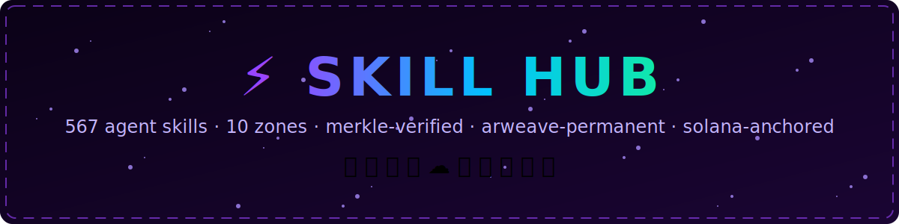

<div align="center">



[](https://skills.sh/Solizardking/skills)
    

**239 installable agent skills.** Every one is a `SKILL.md` playbook your agent can pull off the shelf —
hashed, Merkle-rooted, and ready to be pinned to Arweave and anchored on Solana.

*Pick a cabinet. Pull the lever. The right playbook lights up.* 🕹️

</div>

---

## 🗺️ Choose Your Quest

Nine zones. Every skill lives in exactly one. Click a zone to jump to its catalog.

| Zone | Skills | Power level | What lives here |
|---|---:|---|---|
| [🛠️ **Dev Tools / Agents**](#️-dev-tools--agents) | 17 | `███░░░░░░░░░░░░░░░` | Build, orchestrate, and ship with agent tooling |
| [📣 **Google / Ads**](#-google--ads) | 11 | `██░░░░░░░░░░░░░░░░` | Google Ads APIs, campaigns, and reporting |
| [📈 **Google / Analytics**](#-google--analytics) | 2 | `█░░░░░░░░░░░░░░░░░` | GA4 data APIs and measurement |
| [☁️ **Google / Cloud**](#️-google--cloud) | 56 | `██████████░░░░░░░░` | GCP, GKE, BigQuery, Vertex, and friends |
| [📍 **Local / Web Services**](#-local--web-services) | 6 | `█░░░░░░░░░░░░░░░░░` | Weather, places, food, and everyday web services |
| [🎬 **Media / Devices**](#-media--devices) | 22 | `████░░░░░░░░░░░░░░` | Audio, video, images, TTS, cameras, and gadgets |
| [💬 **Productivity / Messaging**](#-productivity--messaging) | 15 | `███░░░░░░░░░░░░░░░` | Notes, tasks, chat, and mail on autopilot |
| [🟣 **Solana / Blockchain**](#-solana--blockchain) | 98 | `██████████████████` | The deep end: DeFi, perps, tokens, ZK, and on-chain agents |
| [🧰 **Utilities**](#-utilities) | 12 | `██░░░░░░░░░░░░░░░░` | Handy one-off power tools |

## 🚀 Install in 10 Seconds

The whole hub:

```bash
npx skills add Solizardking/skills        # via skills.sh
npx github:Solizardking/skills install    # straight from GitHub
```

Or grab a focused stack:

```bash
# Solana dev core
npx github:Solizardking/skills install solana-dev solana-formal-verification magicblock

# Pump.fun token lifecycle
npx github:Solizardking/skills install pumpfun pump-token-lifecycle pump-bonding-curve pump-security

# ZK compression lane
npx github:Solizardking/skills install compressed-pda compressed-token zk zkrouter

# Google Cloud starter
npx github:Solizardking/skills install google/cloud/gcloud google/cloud/gke-basics google/cloud/bigquery-basics
```

Point it at any agent skill root:

```bash
npx github:Solizardking/skills install --target ~/.codex/skills   # Codex
npx github:Solizardking/skills install --claude                   # Claude Code
npx github:Solizardking/skills install --eve                      # eve (agent/skills/)
```

## 🌟 Featured Runs

Curated multi-skill loadouts — install a run and your agent speaks the whole dialect:

<details>
<summary><strong>🌞 Helius mode</strong> — Helius infra: Sender, DAS, LaserStream + Jupiter, DFlow, OKX, Phantom, SVM internals <em>(6 skills)</em></summary>

[`helius-skills/helius`](./helius-skills/helius/SKILL.md) · [`helius-skills/helius-dflow`](./helius-skills/helius-dflow/SKILL.md) · [`helius-skills/helius-jupiter`](./helius-skills/helius-jupiter/SKILL.md) · [`helius-skills/helius-okx`](./helius-skills/helius-okx/SKILL.md) · [`helius-skills/helius-phantom`](./helius-skills/helius-phantom/SKILL.md) · [`helius-skills/svm`](./helius-skills/svm/SKILL.md)

</details>

<details>
<summary><strong>🎰 Pump.fun mode</strong> — launch → curve → fees → security, the whole token lifecycle <em>(24 skills)</em></summary>

[`pump-admin-ops`](./pump-admin-ops/SKILL.md) · [`pump-ai-agents`](./pump-ai-agents/SKILL.md) · [`pump-bonding-curve`](./pump-bonding-curve/SKILL.md) · [`pump-build-release`](./pump-build-release/SKILL.md) · [`pump-claims-readonly`](./pump-claims-readonly/SKILL.md) · [`pump-fee-sharing`](./pump-fee-sharing/SKILL.md) · [`pump-fee-system`](./pump-fee-system/SKILL.md) · [`pump-mcp-server`](./pump-mcp-server/SKILL.md) · [`pump-rust-vanity`](./pump-rust-vanity/SKILL.md) · [`pump-sdk-core`](./pump-sdk-core/SKILL.md) · [`pump-security`](./pump-security/SKILL.md) · [`pump-shell-scripts`](./pump-shell-scripts/SKILL.md) · [`pump-solana-architecture`](./pump-solana-architecture/SKILL.md) · [`pump-solana-dev`](./pump-solana-dev/SKILL.md) · [`pump-solana-wallet`](./pump-solana-wallet/SKILL.md) · [`pump-testing`](./pump-testing/SKILL.md) · [`pump-token-incentives`](./pump-token-incentives/SKILL.md) · [`pump-token-lifecycle`](./pump-token-lifecycle/SKILL.md) · [`pump-ts-vanity`](./pump-ts-vanity/SKILL.md) · [`pumpfun`](./pumpfun/SKILL.md) · [`pumpfun-analytics`](./pumpfun-analytics/SKILL.md) · [`pumpfun-fees`](./pumpfun-fees/SKILL.md) · [`pumpfun-launcher`](./pumpfun-launcher/SKILL.md) · [`pumpfun-trading`](./pumpfun-trading/SKILL.md)

</details>

<details>
<summary><strong>🌋 Vulcan / Phoenix mode</strong> — perps trading: TA, grids, TWAP, TP/SL, risk <em>(18 skills)</em></summary>

[`vulcan`](./vulcan/SKILL.md) · [`vulcan-error-recovery`](./vulcan-error-recovery/SKILL.md) · [`vulcan-execution-modes`](./vulcan-execution-modes/SKILL.md) · [`vulcan-grid-trading`](./vulcan-grid-trading/SKILL.md) · [`vulcan-lot-size-calculator`](./vulcan-lot-size-calculator/SKILL.md) · [`vulcan-margin-operations`](./vulcan-margin-operations/SKILL.md) · [`vulcan-market-intel`](./vulcan-market-intel/SKILL.md) · [`vulcan-onboarding`](./vulcan-onboarding/SKILL.md) · [`vulcan-portfolio-intel`](./vulcan-portfolio-intel/SKILL.md) · [`vulcan-position-management`](./vulcan-position-management/SKILL.md) · [`vulcan-quickstart`](./vulcan-quickstart/SKILL.md) · [`vulcan-risk-management`](./vulcan-risk-management/SKILL.md) · [`vulcan-skills-index`](./vulcan-skills-index/SKILL.md) · [`vulcan-ta-strategy`](./vulcan-ta-strategy/SKILL.md) · [`vulcan-technical-analysis`](./vulcan-technical-analysis/SKILL.md) · [`vulcan-tpsl-management`](./vulcan-tpsl-management/SKILL.md) · [`vulcan-trade-execution`](./vulcan-trade-execution/SKILL.md) · [`vulcan-twap-execution`](./vulcan-twap-execution/SKILL.md)

</details>

<details>
<summary><strong>👑 Imperial mode</strong> — the imperial trading deck: execution, margin, portfolio intel <em>(12 skills)</em></summary>

[`imperial`](./imperial/SKILL.md) · [`imperial-execution-modes`](./imperial-execution-modes/SKILL.md) · [`imperial-grid-trading`](./imperial-grid-trading/SKILL.md) · [`imperial-margin-operations`](./imperial-margin-operations/SKILL.md) · [`imperial-market-intel`](./imperial-market-intel/SKILL.md) · [`imperial-portfolio-intel`](./imperial-portfolio-intel/SKILL.md) · [`imperial-position-management`](./imperial-position-management/SKILL.md) · [`imperial-risk-management`](./imperial-risk-management/SKILL.md) · [`imperial-skills-index`](./imperial-skills-index/SKILL.md) · [`imperial-tpsl-management`](./imperial-tpsl-management/SKILL.md) · [`imperial-trade-execution`](./imperial-trade-execution/SKILL.md) · [`imperial-twap-execution`](./imperial-twap-execution/SKILL.md)

</details>

<details>
<summary><strong>🎲 DFlow / Kalshi mode</strong> — prediction markets: scan, trade, portfolio, KYC <em>(9 skills)</em></summary>

[`dflow-docs`](./dflow-docs/SKILL.md) · [`dflow-kalshi-market-data`](./dflow-kalshi-market-data/SKILL.md) · [`dflow-kalshi-market-scanner`](./dflow-kalshi-market-scanner/SKILL.md) · [`dflow-kalshi-portfolio`](./dflow-kalshi-portfolio/SKILL.md) · [`dflow-kalshi-trading`](./dflow-kalshi-trading/SKILL.md) · [`dflow-phantom-connect`](./dflow-phantom-connect/SKILL.md) · [`dflow-platform-fees`](./dflow-platform-fees/SKILL.md) · [`dflow-proof-kyc`](./dflow-proof-kyc/SKILL.md) · [`dflow-spot-trading`](./dflow-spot-trading/SKILL.md)

</details>

<details>
<summary><strong>🗜️ ZK compression mode</strong> — Light Protocol: compressed tokens + PDAs, ~400x cheaper <em>(7 skills)</em></summary>

[`ask-mcp`](./ask-mcp/SKILL.md) · [`compressed-pda`](./compressed-pda/SKILL.md) · [`compressed-token`](./compressed-token/SKILL.md) · [`solana-redpill-verifier`](./solana-redpill-verifier/SKILL.md) · [`solana-rent-free-dev`](./solana-rent-free-dev/SKILL.md) · [`zk`](./zk/SKILL.md) · [`zkrouter`](./zkrouter/SKILL.md)

</details>

## 📚 The Full Catalog

Every skill, every zone. Click a zone to expand it — descriptions keep the exact trigger text agents match on.

### 🛠️ Dev Tools / Agents

> Build, orchestrate, and ship with agent tooling — **17 skills**

<details>
<summary>Open the Dev Tools / Agents cabinet</summary>

| Skill | Name | Description |
|---|---|---|
| [`anthropic-skills/algorithmic-art`](./anthropic-skills/algorithmic-art/SKILL.md) | algorithmic-art | Creating algorithmic art using p5.js with seeded randomness and interactive parameter exploration. Use this when users request creating art using code, generative art, algorithmic art, flow fields, or particle systems. Create original algorithmic art rather than copying existing artists' work to avoid copyright violations. |
| [`anthropic-skills/internal-comms`](./anthropic-skills/internal-comms/SKILL.md) | internal-comms | A set of resources to help me write all kinds of internal communications, using the formats that my company likes to use. Claude should use this skill whenever asked to write some sort of internal communications (status reports, leadership updates, 3P updates, company newsletters, FAQs, incident reports, project updates, etc.). |
| [`anthropic-skills/mcp-builder`](./anthropic-skills/mcp-builder/SKILL.md) | mcp-builder | Guide for creating high-quality MCP (Model Context Protocol) servers that enable LLMs to interact with external services through well-designed tools. Use when building MCP servers to integrate external APIs or services, whether in Python (FastMCP) or Node/TypeScript (MCP SDK). |
| [`anthropic-skills/skill-creator`](./anthropic-skills/skill-creator/SKILL.md) | anthropic-skill-creator | Create new skills, modify and improve existing skills, and measure skill performance. Use when users want to create a skill from scratch, edit, or optimize an existing skill, run evals to test a skill, benchmark skill performance with variance analysis, or optimize a skill's description for better triggering accuracy. |
| [`anthropic-skills/web-artifacts-builder`](./anthropic-skills/web-artifacts-builder/SKILL.md) | web-artifacts-builder | Suite of tools for creating elaborate, multi-component claude.ai HTML artifacts using modern frontend web technologies (React, Tailwind CSS, shadcn/ui). Use for complex artifacts requiring state management, routing, or shadcn/ui components - not for simple single-file HTML/JSX artifacts. |
| [`anthropic-skills/xlsx`](./anthropic-skills/xlsx/SKILL.md) | xlsx | Use this skill any time a spreadsheet file is the primary input or output. This means any task where the user wants to: open, read, edit, or fix an existing .xlsx, .xlsm, .csv, or .tsv file (e.g., adding columns, computing formulas, formatting, charting, cleaning messy data); create a new spreadsheet from scratch or from other data sources; or convert between tabular file formats. Trigger especially when the user references a spreadsheet file by name or path — even casually (like "the xlsx in my downloads") — and wants something done to it or produced from it. Also trigger for cleaning or restructuring messy tabular data files (malformed rows, misplaced headers, junk data) into proper spreadsheets. The deliverable must be a spreadsheet file. Do NOT trigger when the primary deliverable is a Word document, HTML report, standalone Python script, database pipeline, or Google Sheets API integration, even if tabular data is involved. |
| [`clawdhub`](./clawdhub/SKILL.md) | clawdhub | Use the ClawdHub CLI to search, install, update, and publish agent skills from clawdhub.com. Use when you need to fetch new skills on the fly, sync installed skills to latest or a specific version, or publish new/updated skill folders with the npm-installed clawdhub CLI. |
| [`create-agent-tui`](./create-agent-tui/SKILL.md) | create-agent-tui | Scaffolds a complete agent TUI in TypeScript using @openrouter/agent — like create-react-app for terminal agents. Generates a customizable terminal interface with three input styles, four tool display modes, ASCII banners, streaming output, session persistence, and configurable tools. Use when building an agent, creating a TUI, scaffolding an agent project, or building a coding assistant. |
| [`github`](./github/SKILL.md) | github | Interact with GitHub using the `gh` CLI. Use `gh issue`, `gh pr`, `gh run`, and `gh api` for issues, PRs, CI runs, and advanced queries. |
| [`mcporter`](./mcporter/SKILL.md) | mcporter | Use the mcporter CLI to list, configure, auth, and call MCP servers/tools directly (HTTP or stdio), including ad-hoc servers, config edits, and CLI/type generation. |
| [`openclawd-clawd-code-skill-main`](./openclawd-clawd-code-skill-main/SKILL.md) | clawd-code-skill | Control Clawd Code via MCP protocol. Trigger with "plan" to write a precise execution plan then feed it to Clawd Code. Also supports direct commands, persistent sessions, agent teams, and advanced tool control. |
| [`openrouter-agent-migration`](./openrouter-agent-migration/SKILL.md) | openrouter-agent-migration | Migration guide from @openrouter/sdk to @openrouter/agent for callModel, tool(), stop conditions, and agent features. This skill should be used when code imports callModel, tool(), or stop conditions from @openrouter/sdk and needs to migrate to @openrouter/agent. |
| [`openrouter-typescript-sdk`](./openrouter-typescript-sdk/SKILL.md) | openrouter-typescript-sdk | Complete reference for integrating with 300+ AI models through the OpenRouter TypeScript SDK and Agent packages using the callModel pattern |
| [`oracle`](./oracle/SKILL.md) | oracle | Best practices for using the oracle CLI (prompt + file bundling, engines, sessions, and file attachment patterns). |
| [`session-logs`](./session-logs/SKILL.md) | session-logs | Search and analyze your own session logs (older/parent conversations) using jq. |
| [`skill-creator`](./skill-creator/SKILL.md) | skill-creator | Create or update AgentSkills. Use when designing, structuring, or packaging skills with scripts, references, and assets. |
| [`tmux`](./tmux/SKILL.md) | tmux | Remote-control tmux sessions for interactive CLIs by sending keystrokes and scraping pane output. |

</details>

### 📣 Google / Ads

> Google Ads APIs, campaigns, and reporting — **11 skills**

<details>
<summary>Open the Google / Ads cabinet</summary>

| Skill | Name | Description |
|---|---|---|
| [`google/ads/data-manager-api/data-manager-api-audience-ingestion`](./google/ads/data-manager-api/data-manager-api-audience-ingestion/SKILL.md) | data-manager-api-audience-ingestion | Guides developers through uploading audience members to Google products using the Data Manager API /v1/audienceMembers/ingest endpoint and its associated client libraries. Use this skill when the user wants to upload audience members for Customer Match, mobile device ID audiences, or any other audience use case supported by the Data Manager API. Don't use for uploading events or conversions (use the data-manager-api-event-ingestion skill). |
| [`google/ads/data-manager-api/data-manager-api-event-ingestion`](./google/ads/data-manager-api/data-manager-api-event-ingestion/SKILL.md) | data-manager-api-event-ingestion | Guides developers through implementing event and conversion ingestion to Google products using the Data Manager API /v1/events/ingest endpoint and its associated client libraries. Use this skill when the user wants to upload offline conversions, enhanced conversions for leads, click conversions, Google Analytics web or app events, or any other event ingestion use case supported by the Data Manager API. Don't use for uploading audience members (use the data-manager-api-audience-ingestion skill). |
| [`google/ads/data-manager-api/data-manager-api-setup`](./google/ads/data-manager-api/data-manager-api-setup/SKILL.md) | data-manager-api-setup | Guides developers through client library installation and authentication setup steps for the Data Manager API. Use this skill when a user is getting started with the Data Manager API and needs to setup their local environment, install the client library, or setup access to the API. Don't use for implementing audience or event ingestion logic (use the data-manager-api-audience-ingestion or data-manager-api-event-ingestion skills instead). |
| [`google/ads/google-ads-api/google-ads-api-mcp-setup`](./google/ads/google-ads-api/google-ads-api-mcp-setup/SKILL.md) | google-ads-api-mcp-setup | Guides developers through downloading, configuring, and installing the official open-source Google Ads MCP Server. Use this skill when a user wants to connect their AI assistant (such as Gemini, Claude Code, or Cursor) to their Google Ads account to query campaigns or retrieve reporting metrics using natural language. |
| [`google/ads/google-ads-api/google-ads-api-quickstart`](./google/ads/google-ads-api/google-ads-api-quickstart/SKILL.md) | google-ads-api-quickstart | Guides developers through Google Ads API quickstart: credential setup, choosing from 6 client libraries/REST, configuring environments, and running a "retrieve campaigns" script. Troubleshoots common setup errors: USER_PERMISSION_DENIED, login_customer_id issues, and DEVELOPER_TOKEN_NOT_APPROVED. |
| [`google/ads/google-mobile-ads/google-mobile-ads-android-migrate-to-next-gen`](./google/ads/google-mobile-ads/google-mobile-ads-android-migrate-to-next-gen/SKILL.md) | google-mobile-ads-android-migrate-to-next-gen | Migrates Android applications from the old, legacy Google Mobile Ads (GMA) SDK (com.google.android.gms:play-services-ads) to the new GMA Next-Gen SDK (com.google.android.libraries.ads.mobile.sdk:ads-mobile-sdk). Provides comprehensive mapping tables for imports, classes, and method signatures to help determine migration steps. Use when migrating an existing Android codebase from the old, legacy GMA SDK to GMA Next-Gen SDK. |
| [`google/ads/google-mobile-ads/google-mobile-ads-banner`](./google/ads/google-mobile-ads/google-mobile-ads-banner/SKILL.md) | google-mobile-ads-banner | Provides instructions to implement, integrate, or configure Google Mobile Ads (GMA) banner ads in Android and iOS mobile applications. Use when the task involves setting up banner ads in a mobile application. |
| [`google/ads/google-mobile-ads/google-mobile-ads-get-started`](./google/ads/google-mobile-ads/google-mobile-ads-get-started/SKILL.md) | google-mobile-ads-get-started | Provides instructions for integrating the Google Mobile Ads (GMA) SDK. Use this skill when the user wants to get started with, install, integrate, set up, or configure the SDK for AdMob or Ad Manager, GMA Next-Gen SDK or mobile ads framework in an Android, iOS, or Unity application. |
| [`google/ads/google-mobile-ads/google-mobile-ads-interstitial`](./google/ads/google-mobile-ads/google-mobile-ads-interstitial/SKILL.md) | google-mobile-ads-interstitial | Provides instructions for implementing, integrating, or configuring Google Mobile Ads (GMA) SDK interstitial ads in Android and iOS mobile applications. Use this skill when the task involves setting up interstitial ads. Don't use for "rewarded interstitial" ads. |
| [`google/ads/google-mobile-ads/google-mobile-ads-rewarded`](./google/ads/google-mobile-ads/google-mobile-ads-rewarded/SKILL.md) | google-mobile-ads-rewarded | Provides instructions for implementing, integrating, or configuring Google Mobile Ads (GMA) SDK rewarded ads in Android or iOS mobile applications. Use this skill when the task involves setting up rewarded ads. Don't use for "rewarded interstitial" ads. |
| [`google/ads/interactive-media-ads/ima-sdk-basics`](./google/ads/interactive-media-ads/ima-sdk-basics/SKILL.md) | ima-sdk-basics | Use this skill for Interactive Media Ads (IMA) SDK client-side ad insertion when you are requesting video ads client-side into websites, apps, TVs or other platforms with VAST or VMAP. Do not use for Dynamic Ad Insertion (DAI), SSAI, or SGAI (use the `ima-sdk-dai-basics` skill instead). |

</details>

### 📈 Google / Analytics

> GA4 data APIs and measurement — **2 skills**

<details>
<summary>Open the Google / Analytics cabinet</summary>

| Skill | Name | Description |
|---|---|---|
| [`google/analytics/google-analytics-admin-api-basics`](./google/analytics/google-analytics-admin-api-basics/SKILL.md) | google-analytics-admin-api-basics | Manages Google Analytics account and property settings, enables the Analytics Admin API via the Cloud CLI, lists accounts and properties, and manages data streams, custom dimensions, conversion events, and integrations. Use when you need to programmatically configure Google Analytics accounts, provision properties, manage data retention, configure Measurement Protocol secrets, or manage Firebase and Google Ads links. |
| [`google/analytics/google-analytics-data-api-basics`](./google/analytics/google-analytics-data-api-basics/SKILL.md) | google-analytics-data-api-basics | Manages Google Analytics reporting data, enables the Analytics Data API via the Cloud CLI, and creates reports using the Google Analytics Data API (v1beta). Use when you need to interact with Google Analytics properties, run customized analytics reports, query metrics (like activeUsers, screenPageViews) and dimensions (like city, date), check metrics and dimensions compatibility, or verify API enablement. |

</details>

### ☁️ Google / Cloud

> GCP, GKE, BigQuery, Vertex, and friends — **56 skills**

<details>
<summary>Open the Google / Cloud cabinet</summary>

| Skill | Name | Description |
|---|---|---|
| [`google/cloud/agent-platform-alert-configuration`](./google/cloud/agent-platform-alert-configuration/SKILL.md) | agent-platform-alert-configuration | Configures best-practice alerting policies for Google Cloud Vertex AI / Agent Platform agents on Agent Runtime. Use when analyzing, writing, or deploying alerting policies to monitor agent latency, error rates, and quality metrics (response quality, tool use, hallucination). Also use when provisioning online monitors for quality evaluation, or analyzing live metrics traffic footprints. NOTE: This skill currently only works for the Agent Runtime. Don't use for configuring general GCP alert policies or non-agent GCP alerting policies. |
| [`google/cloud/agent-platform-deploy`](./google/cloud/agent-platform-deploy/SKILL.md) | agent-platform-deploy | Deploy open models or custom weights from Model Garden to Agent Platform endpoints, check deployment status, verify serving endpoints, or clean up resources by undeploying models and deleting endpoints. Use when asked to deploy models on Agent Platform, list available Model Garden models, check if a model is deployable, query deployment cost, troubleshoot deployment errors (like quota limits), or undeploy/clean up endpoints. Also use when copying and deploying a 1P Tuned Model. Don't use for public Vertex AI deployments (use the `vertex-deploy` skill) or for running model evaluations (use the `agent-platform-eval` skill). |
| [`google/cloud/agent-platform-endpoint-management`](./google/cloud/agent-platform-endpoint-management/SKILL.md) | agent-platform-endpoint-management | Manages Agent Platform serving endpoints. Use when you need to create, list, describe, update, or delete serving endpoints for model deployment on Agent Platform. Also use when troubleshooting endpoint permission, quota, or resource busy errors. Don't use for deploying models to endpoints or for running model evaluations. |
| [`google/cloud/agent-platform-eval-flywheel`](./google/cloud/agent-platform-eval-flywheel/SKILL.md) | agent-platform-eval-flywheel | Measures and improves the quality of AI models and agents on Google Cloud using the Eval Quality Flywheel methodology. Use when evaluating an agent or model, building an eval dataset, picking or writing evaluation metrics, analyzing failures, comparing results before and after a fix, or when guidance is needed on Agent Platform eval methodology — including dataset schema, LLM-as-judge scoring, and common failure causes. For fine-tuning, use agent-platform-tuning. For general production deployment, use agent-platform-deploy. |
| [`google/cloud/agent-platform-inference`](./google/cloud/agent-platform-inference/SKILL.md) | agent-platform-inference | Connects to and performs inference with Google Cloud Agent Platform GenAI models, including First-Party Gemini models and Third-Party OpenMaaS models (Llama, DeepSeek, Qwen, etc.). Use when you need to generate code for calling Gemini or OpenMaaS models, authenticate with GenAI SDK, OpenAI SDK, or legacy Agent Platform SDK, configure base URLs and global/regional endpoints, or troubleshoot 429 Resource Exhausted (DSQ), 400 User Validation, or 404 Not Found errors. Don't use for deploying models to endpoints or for running model evaluations. |
| [`google/cloud/agent-platform-migrate-from-ai-studio`](./google/cloud/agent-platform-migrate-from-ai-studio/SKILL.md) | agent-platform-migrate-from-ai-studio | Guides agents and users through migrating from Gemini API in Google AI Studio to Gemini Enterprise Agent Platform (formerly Vertex AI). Use this skill when moving applications to Google Cloud, to leverage Cloud credits, or to unify inferencing with other Cloud infrastructure (IAM, billing, telemetry). |
| [`google/cloud/agent-platform-model-registry`](./google/cloud/agent-platform-model-registry/SKILL.md) | agent-platform-model-registry | Agent Platform Model Registry Management. Use when you need to upload, list, describe, update, or delete machine learning models (and their versions) in the Agent Platform Model Registry. Don't use for model training, model deployment to endpoints, or managing non-Agent Platform models. |
| [`google/cloud/agent-platform-prompt-management`](./google/cloud/agent-platform-prompt-management/SKILL.md) | agent-platform-prompt-management | Manages and orchestrates prompts in Agent Platform. Use when you need to create, list, retrieve, version, or delete managed prompts in Agent Platform. Don't use for model training, model deployment to endpoints, or managing non-Agent Platform prompts. |
| [`google/cloud/agent-platform-rag-engine-management`](./google/cloud/agent-platform-rag-engine-management/SKILL.md) | agent-platform-rag-engine-management | Manage and query Agent Platform RAG Engine Corpora and retrieve grounded contexts using the Google GenAI SDK. Use when listing RAG corpora or files, inspecting a corpus, retrieving contexts, or generating content grounded in a RAG corpus. Do not use for standard database queries (use SQL/Spanner skills), Google Workspace RAG, or other RAG products like gRAG. |
| [`google/cloud/agent-platform-skill-registry`](./google/cloud/agent-platform-skill-registry/SKILL.md) | agent-platform-skill-registry | Interact with the Gemini Enterprise Agent Platform Skill Registry to create and search for available skills. Use this skill to enable agents to register functionality or discover new capabilities. |
| [`google/cloud/agent-platform-tuning`](./google/cloud/agent-platform-tuning/SKILL.md) | agent-platform-tuning | Agent Platform Model Tuning. Use when you need to fine-tune open models or Gemini models using Agent Platform infrastructure. Don't use for model training outside Agent Platform, model deployment to endpoints (use `agent-platform-deploy`), or managing serving endpoints (use `agent-platform-endpoint-management`). |
| [`google/cloud/agent-platform-tuning-management`](./google/cloud/agent-platform-tuning-management/SKILL.md) | agent-platform-tuning-management | Manages GenAI tuning jobs in Agent Platform. Use this to list, get, or cancel ongoing model tuning jobs. Don't use for fine-tuning models (use `agent-platform-tuning`), deploying models to endpoints (use `agent-platform-deploy`), or managing serving endpoints (use `agent-platform-endpoint-management`). |
| [`google/cloud/alloydb-basics`](./google/cloud/alloydb-basics/SKILL.md) | alloydb-basics | Manages clusters, instances, and backups for AlloyDB for PostgreSQL, and integrates with AlloyDB model context protocol (MCP) tools for automated database operations. |
| [`google/cloud/bigquery-ai-ml`](./google/cloud/bigquery-ai-ml/SKILL.md) | bigquery-ai-ml | Leverages BigQuery's built-in machine learning and GenAI capabilities for advanced data analytics. Use when you need to write SQL queries that perform time-series forecasting, detect outliers, find key drivers, or leverage generative AI capabilities in BigQuery. |
| [`google/cloud/bigquery-basics`](./google/cloud/bigquery-basics/SKILL.md) | bigquery-basics | Manages datasets, tables, and jobs in BigQuery. Use when you need to interact with BigQuery, run SQL queries, manage BigQuery resources (datasets, tables, views), or perform basic data ingestion and analysis. |
| [`google/cloud/bigquery-bigframes`](./google/cloud/bigquery-bigframes/SKILL.md) | bigquery-bigframes | Generates Python code using BigQuery DataFrames (BigFrames), the pandas/scikit-learn-style API over BigQuery. Use when writing BigFrames code or doing pandas-style dataframe/ML work against BigQuery (e.g. in a notebook). Don't use for SQL-first workflows or the google-cloud-bigquery client library — use bigquery-basics. |
| [`google/cloud/bigtable-basics`](./google/cloud/bigtable-basics/SKILL.md) | bigtable-basics | Assists in provisioning instances/tables, designing performant schemas, and querying data in Bigtable. Use when designing Bigtable row keys, configuring column families, writing SQL queries or client library code (Java, Go, Python) for Bigtable, or diagnosing performance/hotspotting issues. Also use when provisioning Bigtable clusters using gcloud or cbt CLIs. Don't use for generic Cloud SQL administration. |
| [`google/cloud/cloud-run-basics`](./google/cloud/cloud-run-basics/SKILL.md) | cloud-run-basics | Manages Cloud Run services, jobs, and worker pools. Use when you need to deploy applications responding to HTTP requests (services), run event-triggered or scheduled tasks (jobs), or handle always-on pull-based background processing (worker pools). |
| [`google/cloud/cloud-sql-basics`](./google/cloud/cloud-sql-basics/SKILL.md) | cloud-sql-basics | This file generates or explains Cloud SQL resources. Use this file when the user asks to create a Cloud SQL instance or database for MySQL, PostgreSQL, or SQL Server. |
| [`google/cloud/datalineage-bigquery-asset-impact-analysis`](./google/cloud/datalineage-bigquery-asset-impact-analysis/SKILL.md) | datalineage-bigquery-asset-impact-analysis | Analyzes the downstream impact (blast radius) when a BigQuery table or view is broken, stale, or modified. Identifies all downstream tables, dashboards, and processes that will be affected. Use when: - Performing a blast radius or impact analysis for a BigQuery table or view. - Assessing the consequences of modifying, deleting, or pausing updates to a BigQuery asset. - Identifying downstream dependencies (tables, dashboards, processes) of a BigQuery asset. Don't use for: - General BigQuery querying or data analysis (use BigQuery-related tools instead). - Non-BigQuery assets (e.g., Cloud Storage files) unless they are part of the BigQuery lineage. - Creating or modifying lineage links directly. |
| [`google/cloud/detection-engineering-coverage-evaluation`](./google/cloud/detection-engineering-coverage-evaluation/SKILL.md) | detection-engineering-coverage-evaluation | Automates the end-to-end detection engineering workflow in Google SecOps using MCP tools. Use when fetching threat intelligence from blogs, generating Threat Detection Opportunities (TDOs), simulating attacker behavior with synthetic UDM events, evaluating rule coverage, and generating new YARA-L 2.0 rules to close coverage gaps. Don't use when asked to perform threat hunting actions, and SOC investigative actions. |
| [`google/cloud/firebase-basics`](./google/cloud/firebase-basics/SKILL.md) | firebase-basics | Use this skill whenever you are working on a project that uses Firebase products or services, especially for mobile or web apps. |
| [`google/cloud/gcloud`](./google/cloud/gcloud/SKILL.md) | gcloud | Interacts with Google Cloud services using the gcloud CLI safely and efficiently. Covers command validation, data reduction, safety guardrails with a denylist, and workflows for discovery and investigation. You MUST read this skill before invoking any gcloud command. Use when managing cloud resources, querying configurations, or troubleshooting issues via gcloud. Don't use when writing or debugging Google Cloud client library code or raw REST/gRPC API interactions. |
| [`google/cloud/gemini-agents-api`](./google/cloud/gemini-agents-api/SKILL.md) | gemini-agents-api | Manages custom Agent resources on Gemini Enterprise Agent Platform. Use when the user wants to programmatically create, configure, list, update, or delete stateful, server-managed Agent resources (including mounting files, skills, and tools) before executing conversations. |
| [`google/cloud/gemini-api`](./google/cloud/gemini-api/SKILL.md) | gemini-api | Use when the user asks about using Gemini in an enterprise environment or explicitly mentions Vertex AI, Google Cloud, or Agent Platform. Guides the usage of the Gemini API on Agent Platform with the Google Gen AI SDK. Covers SDK usage (Python, JS/TS, Go, Java, C#), capabilities like multimodal inputs, tools, media generation, caching, batch prediction, and Live API. |
| [`google/cloud/gemini-interactions-api`](./google/cloud/gemini-interactions-api/SKILL.md) | gemini-interactions-api | Guides the usage of Gemini Interactions API on Gemini Enterprise Agent Platform. Use when the user wants to use the stateful, server-managed Interactions API for multi-turn conversations, background execution, streaming, structured output, and function calling on the Agent Platform. |
| [`google/cloud/gke-app-onboarding`](./google/cloud/gke-app-onboarding/SKILL.md) | gke-app-onboarding | Manages GKE application onboarding, covering containerization, deployment manifests, and migration. Use when onboarding or deploying an application to GKE for the first time, or containerizing an app for GKE. Don't use for general GKE cluster administration or upgrades (use gke-basics or gke-upgrades instead). |
| [`google/cloud/gke-backup-dr`](./google/cloud/gke-backup-dr/SKILL.md) | gke-backup-dr | Configures GKE Backup Plans and restore workflows. Use for backup policies, disaster recovery, or GKE cluster restores. Don't use for database backups. |
| [`google/cloud/gke-basics`](./google/cloud/gke-basics/SKILL.md) | gke-basics | Core GKE cluster discovery and hub. Use to route to specialized GKE skills. Do not use for specialized tasks (networking, security, etc.) directly. |
| [`google/cloud/gke-batch-hpc`](./google/cloud/gke-batch-hpc/SKILL.md) | gke-batch-hpc | Runs batch and HPC workloads on GKE, utilizing job queues and parallel processing. Use when running GKE batch jobs, configuring GKE HPC, or setting up GKE job queues. Don't use for standard web application deployments (use gke-app-onboarding instead). |
| [`google/cloud/gke-cluster-creation`](./google/cloud/gke-cluster-creation/SKILL.md) | gke-cluster-creation | Plans and executes GKE cluster creation, provisioning, and production readiness audits. Use when creating GKE clusters, provisioning GKE environments, or auditing GKE clusters. Don't use for application onboarding or deployment configuration (use gke-app-onboarding instead). |
| [`google/cloud/gke-compute-classes`](./google/cloud/gke-compute-classes/SKILL.md) | gke-compute-classes | Configures, optimizes, and troubleshoots GKE ComputeClasses. Use when configuring Spot VMs with on-demand fallback, targeting specific accelerators (GPUs/TPUs) or machine families, restricting ComputeClass access, or debugging pending pods related to node pool auto-creation. Do not use for cluster-level Node Auto Provisioning configuration or general GKE cluster creation. |
| [`google/cloud/gke-cost`](./google/cloud/gke-cost/SKILL.md) | gke-cost | Optimizes GKE costs, rightsizes workloads, and configures Spot VMs and CUDs. Use when optimizing GKE costs, rightsizing GKE workloads, or configuring GKE Spot VMs. Don't use for general compute class provisioning or GPU Selection (use gke-compute-classes instead). |
| [`google/cloud/gke-golden-path`](./google/cloud/gke-golden-path/SKILL.md) | gke-golden-path | Provides GKE golden path configuration defaults, production readiness checklists, and cluster default patterns. Use when designing GKE clusters, verifying GKE production readiness, or checking configurations against GKE defaults. Don't use for setting up node autoscaling specifically (use gke-scaling instead). |
| [`google/cloud/gke-inference`](./google/cloud/gke-inference/SKILL.md) | gke-inference | Deploys and optimizes AI/ML inference workloads on GKE, using GPUs, TPUs, and model servers. Use when deploying GKE inference servers, configuring GKE GPU resources for inference, or deploying LLMs on GKE. Don't use for generic batch jobs or HPC task queues (use gke-batch-hpc instead). |
| [`google/cloud/gke-multitenancy`](./google/cloud/gke-multitenancy/SKILL.md) | gke-multitenancy | Plans and configures multi-tenancy on GKE. Covers namespace isolation, RBAC planning for teams, resource quotas, LimitRanges, network isolation, and cost allocation. Use when designing GKE multi-tenancy, configuring GKE namespaces, setting up resource quotas, or isolating GKE teams. Don't use for single-tenant cluster configuration or general deployment instructions (use gke-basics or gke-app-onboarding instead). |
| [`google/cloud/gke-networking`](./google/cloud/gke-networking/SKILL.md) | gke-networking | Plans, configures, and manages GKE networking. Covers private clusters, VPC- native configurations, Gateway API, DNS, ingress/egress, Dataplane V2, and IP planning. Use when designing GKE networking layouts, configuring private clusters, setting up Gateway API, planning GKE IP ranges, or configuring GKE ingress/egress. Don't use for basic application routing that does not require dedicated network configuration. |
| [`google/cloud/gke-observability`](./google/cloud/gke-observability/SKILL.md) | gke-observability | Configures GKE observability, including Cloud Logging, Cloud Monitoring, and managed Prometheus. Use when configuring GKE monitoring, setting up GKE logging, or configuring Prometheus metrics collection. Don't use to configure local application logging frameworks or external APMs outside GKE. |
| [`google/cloud/gke-reliability`](./google/cloud/gke-reliability/SKILL.md) | gke-reliability | Improves GKE workload reliability, using PDBs, health probes, and topology spread constraints. Use when configuring GKE workload reliability, setting up PDBs, or configuring GKE health probes (liveness, readiness, startup). Don't use for disaster recovery setup or full cluster backups (use gke-backup-dr instead). |
| [`google/cloud/gke-scaling`](./google/cloud/gke-scaling/SKILL.md) | gke-scaling | Configures GKE autoscaling, including HPA, VPA, and Node Auto-Provisioning (NAP). Use when configuring GKE autoscaling, setting up GKE HPA, setting up GKE VPA, or configuring GKE NAP. Don't use for configuring static cluster sizes or setting node-level machine styles directly (use gke-compute-classes instead). |
| [`google/cloud/gke-security`](./google/cloud/gke-security/SKILL.md) | gke-security | Plans, configures, and hardens Google Kubernetes Engine (GKE) security. Covers Workload Identity Federation, Secret Manager integration, RBAC hardening, Binary Authorization, Network Policies (Dataplane V2), Pod Security Standards, and IAM roles. Use when securing GKE clusters, setting up Workload Identity, hardening RBAC configurations, or configuring GKE secrets. Don't use for general network routing configuration (use gke-networking instead). |
| [`google/cloud/gke-storage`](./google/cloud/gke-storage/SKILL.md) | gke-storage | Manages GKE storage, including PVCs, PersistentVolumes, Filestore, and GCS FUSE. Use when configuring GKE storage, creating PVCs, or setting up GCS FUSE on GKE. Don't use for database administration or replication strategies outside volume provisioning context. |
| [`google/cloud/gke-upgrades`](./google/cloud/gke-upgrades/SKILL.md) | gke-upgrades | Plans, executes, and validates Google Kubernetes Engine (GKE) cluster upgrades and maintenance operations for both Standard and Autopilot clusters. Produces upgrade plans, pre/post-upgrade checklists, maintenance runbooks with gcloud commands, release channel strategy, and troubleshooting guides. Handles node pool upgrade strategies (surge, blue-green), version compatibility, PDB management, and workload-specific concerns (stateful, GPU, operators). Use this skill whenever the user mentions GKE upgrades, Kubernetes version bumps, node pool maintenance, GKE patching, cluster version management, release channel selection, maintenance windows, surge upgrades, stuck upgrades, or any GKE lifecycle management task — even casual mentions like "we need to upgrade our clusters" or "plan our next GKE maintenance" or "our upgrade is stuck." Don't use for GKE cluster creation, application onboarding, general networking/routing setup, or security policy configurations (use gke-basics or relevant GKE skills instead). |
| [`google/cloud/google-agents-cli-onboarding`](./google/cloud/google-agents-cli-onboarding/SKILL.md) | google-agents-cli-onboarding | Onboarding entrypoint for agents-cli in Agent Platform. It should be used when the user wants to "create a new agent", "develop an agent", "build an agent using ADK", "run the agent locally", "debug agent code", "test an agent", "evaluate an agent", "deploy an agent", "publish an agent", "monitor an agent", or needs the ADK (Agent Development Kit) development lifecycle. |
| [`google/cloud/google-cloud-networking-observability`](./google/cloud/google-cloud-networking-observability/SKILL.md) | google-cloud-networking-observability | Investigates Google Cloud networking issues by analyzing logs, metrics, and diagnostics. Use when investigating VPC Flow Logs (including cost estimation), NAT, firewall, or threat logs, querying latency and throughput metrics, or running Connectivity Tests for path diagnostics. Don't use for generic VM management or non-observability tasks. |
| [`google/cloud/google-cloud-recipe-auth`](./google/cloud/google-cloud-recipe-auth/SKILL.md) | google-cloud-recipe-auth | Provides expert guidance on authenticating and authorizing to Google Cloud services and APIs, covering human users, service identities, Application Default Credentials (ADC), and best practices for secure access. |
| [`google/cloud/google-cloud-recipe-foundation-builder`](./google/cloud/google-cloud-recipe-foundation-builder/SKILL.md) | google-cloud-recipe-foundation-builder | Deploys a baseline landing zone foundation for a Google Cloud Organization, establishing security guardrails using Organization Policies, resource hierarchy folders and projects, billing association, and centralized logging and monitoring. Deploys Google Cloud's recommended security controls and architecture. Use when setting up a new Google Cloud Organization or establishing a secure, enterprise-grade landing zone foundation. |
| [`google/cloud/google-cloud-recipe-onboarding`](./google/cloud/google-cloud-recipe-onboarding/SKILL.md) | google-cloud-recipe-onboarding | Guides a developer's first steps on Google Cloud, covering account creation, billing setup, project management, and deploying a first resource. Use when a new developer wants to initialize their first Google Cloud project, configure billing, and verify deployment. Don't use for enterprise organization setup (use Google Cloud Setup guided flow for that instead). Don't use for complex multi-project architectures. |
| [`google/cloud/google-cloud-waf-cost-optimization`](./google/cloud/google-cloud-waf-cost-optimization/SKILL.md) | google-cloud-waf-cost-optimization | Generates cost optimization guidance for Google Cloud workloads based on the Google Cloud Well-Architected Framework (WAF). Use this skill to evaluate a workload, identify cost requirements and constraints, and provide actionable recommendations for build, deploy, and manage the workload cost-efficiently in Google Cloud. |
| [`google/cloud/google-cloud-waf-operational-excellence`](./google/cloud/google-cloud-waf-operational-excellence/SKILL.md) | google-cloud-waf-operational-excellence | Generates operations-focused guidance for Google Cloud workloads based on the design principles and recommendations in the Operational Excellence pillar of the Google Cloud Well-Architected Framework (WAF). Use this skill to evaluate a workload, identify operational requirements, and provide actionable recommendations for deployment, monitoring, and incident management. |
| [`google/cloud/google-cloud-waf-performance-optimization`](./google/cloud/google-cloud-waf-performance-optimization/SKILL.md) | google-cloud-waf-performance-optimization | Generates performance-focused guidance for Google Cloud workloads based on the design principles and recommendations in the Performance Optimization pillar of the Google Cloud Well-Architected Framework (WAF). Use this skill to evaluate a workload, identify performance requirements, and provide actionable recommendations for resource allocation, modular design, and elasticity. |
| [`google/cloud/google-cloud-waf-reliability`](./google/cloud/google-cloud-waf-reliability/SKILL.md) | google-cloud-waf-reliability | Generates reliability-focused guidance for Google Cloud workloads based on the design principles and recommendations in the Google Cloud Well-Architected Framework. Use this skill to evaluate a workload, identify reliability requirements, and provide actionable recommendations for build, deploy, and manage the workload reliably in Google Cloud. |
| [`google/cloud/google-cloud-waf-security`](./google/cloud/google-cloud-waf-security/SKILL.md) | google-cloud-waf-security | Generates security-focused guidance for Google Cloud workloads based on the design principles and recommendations in the Google Cloud Well-Architected Framework (WAF). Use this skill to evaluate a workload, identify security requirements, and provide actionable recommendations for IAM, network security, data protection, and operational security. |
| [`google/cloud/google-cloud-waf-sustainability`](./google/cloud/google-cloud-waf-sustainability/SKILL.md) | google-cloud-waf-sustainability | Generates sustainability-focused guidance for Google Cloud workloads based on the design principles and recommendations in the Google Cloud Well-Architected Framework (WAF). Use this skill to evaluate a workload, identify environmental impact requirements, and provide actionable recommendations to build, deploy, and manage the workload sustainably in Google Cloud. |
| [`google/cloud/iam-recommendations-fetcher`](./google/cloud/iam-recommendations-fetcher/SKILL.md) | iam-recommendations-fetcher | Fetches raw IAM recommendations and associated security insights from Google Cloud for a specified target scope (Organization, Folder, or Project). Use when you need to retrieve security recommendations before analyzing or applying them. Don't use for applying/acting on recommendations (use the recommendation applier skill) or for general allow policy querying (use the allow policy viewer skill). |
| [`google/cloud/workload-manager-basics`](./google/cloud/workload-manager-basics/SKILL.md) | workload-manager-basics | Use this skill to manage Google Cloud Workload Manager evaluations, rules, scanned resources, and validation results by using public client libraries and the REST API. Use when you need to inspect workload best-practice rules, create and run evaluations for Google Cloud general best practices, SAP, SQL Server, or custom organizational rules, review violations, export results to BigQuery, or automate Workload Manager through client libraries because no service-specific public CLI or MCP server is available. Don't use for general Google Compute Engine instance management, VPC configuration, or standard IAM auditing. |

</details>

### 📍 Local / Web Services

> Weather, places, food, and everyday web services — **6 skills**

<details>
<summary>Open the Local / Web Services cabinet</summary>

| Skill | Name | Description |
|---|---|---|
| [`anthropic-skills/webapp-testing`](./anthropic-skills/webapp-testing/SKILL.md) | webapp-testing | Toolkit for interacting with and testing local web applications using Playwright. Supports verifying frontend functionality, debugging UI behavior, capturing browser screenshots, and viewing browser logs. |
| [`food-order`](./food-order/SKILL.md) | food-order | Reorder Foodora orders + track ETA/status with ordercli. Never confirm without explicit user approval. Triggers: order food, reorder, track ETA. |
| [`goplaces`](./goplaces/SKILL.md) | goplaces | Query Google Places API (New) via the goplaces CLI for text search, place details, resolve, and reviews. Use for human-friendly place lookup or JSON output for scripts. |
| [`local-places`](./local-places/SKILL.md) | local-places | Search for places (restaurants, cafes, etc.) via Google Places API proxy on localhost. |
| [`ordercli`](./ordercli/SKILL.md) | ordercli | Foodora-only CLI for checking past orders and active order status (Deliveroo WIP). |
| [`weather`](./weather/SKILL.md) | weather | Get current weather and forecasts (no API key required). |

</details>

### 🎬 Media / Devices

> Audio, video, images, TTS, cameras, and gadgets — **22 skills**

<details>
<summary>Open the Media / Devices cabinet</summary>

| Skill | Name | Description |
|---|---|---|
| [`anthropic-skills/canvas-design`](./anthropic-skills/canvas-design/SKILL.md) | canvas-design | Create beautiful visual art in .png and .pdf documents using design philosophy. You should use this skill when the user asks to create a poster, piece of art, design, or other static piece. Create original visual designs, never copying existing artists' work to avoid copyright violations. |
| [`anthropic-skills/docx`](./anthropic-skills/docx/SKILL.md) | docx | Use this skill whenever the user wants to create, read, edit, or manipulate Word documents (.docx files). Triggers include: any mention of 'Word doc', 'word document', '.docx', or requests to produce professional documents with formatting like tables of contents, headings, page numbers, or letterheads. Also use when extracting or reorganizing content from .docx files, inserting or replacing images in documents, performing find-and-replace in Word files, working with tracked changes or comments, or converting content into a polished Word document. If the user asks for a 'report', 'memo', 'letter', 'template', or similar deliverable as a Word or .docx file, use this skill. Do NOT use for PDFs, spreadsheets, Google Docs, or general coding tasks unrelated to document generation. |
| [`anthropic-skills/pdf`](./anthropic-skills/pdf/SKILL.md) | pdf | Use this skill whenever the user wants to do anything with PDF files. This includes reading or extracting text/tables from PDFs, combining or merging multiple PDFs into one, splitting PDFs apart, rotating pages, adding watermarks, creating new PDFs, filling PDF forms, encrypting/decrypting PDFs, extracting images, and OCR on scanned PDFs to make them searchable. If the user mentions a .pdf file or asks to produce one, use this skill. |
| [`anthropic-skills/slack-gif-creator`](./anthropic-skills/slack-gif-creator/SKILL.md) | slack-gif-creator | Knowledge and utilities for creating animated GIFs optimized for Slack. Provides constraints, validation tools, and animation concepts. Use when users request animated GIFs for Slack like "make me a GIF of X doing Y for Slack." |
| [`blucli`](./blucli/SKILL.md) | blucli | BluOS CLI (blu) for discovery, playback, grouping, and volume. |
| [`camsnap`](./camsnap/SKILL.md) | camsnap | Capture frames or clips from RTSP/ONVIF cameras. |
| [`canvas`](./canvas/SKILL.md) | canvas | Display HTML content on connected Clawdbot nodes across Mac, iOS, and Android canvas views. Use for presenting generated HTML, dashboards, games, visualizations, and interactive demos through the Clawdbot canvas host and node bridge. |
| [`gifgrep`](./gifgrep/SKILL.md) | gifgrep | Search GIF providers with CLI/TUI, download results, and extract stills/sheets. |
| [`nano-banana-pro`](./nano-banana-pro/SKILL.md) | nano-banana-pro | Generate or edit images via Gemini 3 Pro Image (Nano Banana Pro). |
| [`nano-pdf`](./nano-pdf/SKILL.md) | nano-pdf | Edit PDFs with natural-language instructions using the nano-pdf CLI. |
| [`openai-whisper`](./openai-whisper/SKILL.md) | openai-whisper | Local speech-to-text with the Whisper CLI (no API key). |
| [`openai-whisper-api`](./openai-whisper-api/SKILL.md) | openai-whisper-api | Transcribe audio via OpenAI Audio Transcriptions API (Whisper). |
| [`openhue`](./openhue/SKILL.md) | openhue | Control Philips Hue lights/scenes via the OpenHue CLI. |
| [`openrouter-images`](./openrouter-images/SKILL.md) | openrouter-images | Generate images from text prompts and edit existing images using OpenRouter's image generation models. Use when the user asks to create, generate, or make an image, picture, or illustration from a description, or wants to edit, modify, transform, or alter an existing image with a text prompt. |
| [`sag`](./sag/SKILL.md) | sag | ElevenLabs text-to-speech with mac-style say UX. |
| [`sherpa-onnx-tts`](./sherpa-onnx-tts/SKILL.md) | sherpa-onnx-tts | Local text-to-speech via sherpa-onnx (offline, no cloud) |
| [`songsee`](./songsee/SKILL.md) | songsee | Generate spectrograms and feature-panel visualizations from audio with the songsee CLI. |
| [`sonoscli`](./sonoscli/SKILL.md) | sonoscli | Control Sonos speakers (discover/status/play/volume/group). |
| [`spotify-player`](./spotify-player/SKILL.md) | spotify-player | Terminal Spotify playback/search via spogo (preferred) or spotify_player. |
| [`summarize`](./summarize/SKILL.md) | summarize | Summarize or extract text/transcripts from URLs, podcasts, and local files (great fallback for “transcribe this YouTube/video”). |
| [`video-frames`](./video-frames/SKILL.md) | video-frames | Extract frames or short clips from videos using ffmpeg. |
| [`voice-call`](./voice-call/SKILL.md) | voice-call | Start voice calls via the Clawdbot voice-call plugin. |

</details>

### 💬 Productivity / Messaging

> Notes, tasks, chat, and mail on autopilot — **15 skills**

<details>
<summary>Open the Productivity / Messaging cabinet</summary>

| Skill | Name | Description |
|---|---|---|
| [`anthropic-skills/pptx`](./anthropic-skills/pptx/SKILL.md) | pptx | Use this skill any time a .pptx file is involved in any way — as input, output, or both. This includes: creating slide decks, pitch decks, or presentations; reading, parsing, or extracting text from any .pptx file (even if the extracted content will be used elsewhere, like in an email or summary); editing, modifying, or updating existing presentations; combining or splitting slide files; working with templates, layouts, speaker notes, or comments. Trigger whenever the user mentions "deck," "slides," "presentation," or references a .pptx filename, regardless of what they plan to do with the content afterward. If a .pptx file needs to be opened, created, or touched, use this skill. |
| [`apple-notes`](./apple-notes/SKILL.md) | apple-notes | Manage Apple Notes via the `memo` CLI on macOS (create, view, edit, delete, search, move, and export notes). Use when a user asks Clawdbot to add a note, list notes, search notes, or manage note folders. |
| [`apple-reminders`](./apple-reminders/SKILL.md) | apple-reminders | Manage Apple Reminders via the `remindctl` CLI on macOS (list, add, edit, complete, delete). Supports lists, date filters, and JSON/plain output. |
| [`bear-notes`](./bear-notes/SKILL.md) | bear-notes | Create, search, and manage Bear notes via grizzly CLI. |
| [`bluebubbles`](./bluebubbles/SKILL.md) | bluebubbles | Build or update the BlueBubbles external channel plugin for Clawdbot (extension package, REST send/probe, webhook inbound). |
| [`discord`](./discord/SKILL.md) | discord | Use when you need to control Discord from Clawdbot via the discord tool: send messages, react, post or upload stickers, upload emojis, run polls, manage threads/pins/search, create/edit/delete channels and categories, fetch permissions or member/role/channel info, or handle moderation actions in Discord DMs or channels. |
| [`gog`](./gog/SKILL.md) | gog | Google Workspace CLI for Gmail, Calendar, Drive, Contacts, Sheets, and Docs. |
| [`himalaya`](./himalaya/SKILL.md) | himalaya | CLI to manage emails via IMAP/SMTP. Use `himalaya` to list, read, write, reply, forward, search, and organize emails from the terminal. Supports multiple accounts and message composition with MML (MIME Meta Language). |
| [`imsg`](./imsg/SKILL.md) | imsg | iMessage/SMS CLI for listing chats, history, watch, and sending. |
| [`notion`](./notion/SKILL.md) | notion | Notion API for creating and managing pages, databases, and blocks. |
| [`obsidian`](./obsidian/SKILL.md) | obsidian | Work with Obsidian vaults (plain Markdown notes) and automate via obsidian-cli. |
| [`slack`](./slack/SKILL.md) | slack | Use when you need to control Slack from Clawdbot via the slack tool, including reacting to messages or pinning/unpinning items in Slack channels or DMs. |
| [`things-mac`](./things-mac/SKILL.md) | things-mac | Manage Things 3 via the `things` CLI on macOS (add/update projects+todos via URL scheme; read/search/list from the local Things database). Use when a user asks Clawdbot to add a task to Things, list inbox/today/upcoming, search tasks, or inspect projects/areas/tags. |
| [`trello`](./trello/SKILL.md) | trello | Manage Trello boards, lists, and cards via the Trello REST API. |
| [`wacli`](./wacli/SKILL.md) | wacli | Send WhatsApp messages to other people or search/sync WhatsApp history via the wacli CLI (not for normal user chats). |

</details>

### 🟣 Solana / Blockchain

> The deep end: DeFi, perps, tokens, ZK, and on-chain agents — **98 skills**

<details>
<summary>Open the Solana / Blockchain cabinet</summary>

| Skill | Name | Description |
|---|---|---|
| [`anthropic-skills/claude-api`](./anthropic-skills/claude-api/SKILL.md) | claude-api | Reference for the Claude API / Anthropic SDK — model ids, pricing, params, streaming, tool use, MCP, agents, caching, token counting, model migration. TRIGGER — read BEFORE opening the target file; don't skip because it "looks like a one-liner" — whenever: the prompt names Claude/Anthropic in any form (Claude, Anthropic, Fable, Opus, Sonnet, Haiku, `anthropic`, `@anthropic-ai`, `claude-*`, `us.anthropic.*`, `[1m]`); the user asks about an LLM (pricing/model choice/limits/caching) — never answer from memory; OR the task is LLM-shaped with provider unstated (agent/MCP/tool-definition/multi-agent/RAG/LLM-judge/computer-use; generate/summarize/extract/classify/rewrite/converse over NL; debugging refusals/cutoffs/streaming/tool-calls/tokens). SKIP only when another provider is being worked on (overrides all triggers): OpenAI/GPT/Gemini/Llama/Mistral/Cohere/Ollama named in the query; OR `grep -rE 'openai\|langchain_openai\|google.generativeai\|genai\|mistralai\|cohere\|ollama'` over the project hits (run this grep FIRST if no provider named — don't Read the file). |
| [`ask-mcp`](./ask-mcp/SKILL.md) | ask-mcp | For questions about Light Protocol's SDK, smart contracts and Solana development, Claude Code features, or agent skills. AI-powered answers grounded in repository context via DeepWiki MCP. |
| [`cheshire-terminal`](./cheshire-terminal/SKILL.md) | cheshire-terminal | Operate and extend Cheshire Terminal, the cheshireterminal.ai voice-controlled Solana terminal powered by $CLAWD. Use when working on voice terminal flows, token launch commands, LiveKit voice integration, Jupiter swap surfaces, burn/staking flows, or any task that mentions Cheshire Terminal, cheshireterminal.ai, $CLAWD terminal, or Clawd voice commands. |
| [`clawd-agent-launchpad`](./clawd-agent-launchpad/SKILL.md) | clawd-agent-launchpad | Build, launch, stake, and manage Clawd or Cheshire Terminal agents. Use when working on Agent Launchpad, agent templates, agent builder, agent hub, deployed agent detail pages, runtime matrix, Metaplex agent minting, staking, agent chat, or Clawd/Cheshire agent lifecycle tasks. |
| [`clawd-skills-installer`](./clawd-skills-installer/SKILL.md) | clawd-skills-installer | Install and make Clawd, Cheshire Terminal, Solizardking, Vercel, and eve agent skills available to local coding agents. Use when a user asks to add all skills, install this repo with npx github, install into ~/.agents/skills, ~/.codex/skills, ~/.claude/skills, or an eve project's agent/skills directory. |
| [`clawd-token-ops`](./clawd-token-ops/SKILL.md) | clawd-token-ops | Work with $CLAWD token operations for Solana CLAWD and Cheshire Terminal. Use when checking or documenting the $CLAWD mint, token-gated balances, Jupiter buy/swap flows, burn tracking, holders, staking, treasury payments, or any task that asks to include the Clawd token address. |
| [`clawd-trading-terminal`](./clawd-trading-terminal/SKILL.md) | clawd-trading-terminal | Use or implement Cheshire Terminal trading surfaces for $CLAWD and Solana markets. Use when working on live spot trading, Jupiter swaps, DFlow markets, OODA trading flows, Phoenix perps, DEX/contract explorer, wallet scanner, Pump page, token tickers, or Clawd trading terminal workflows. |
| [`clawdex`](./clawdex/SKILL.md) | clawdex | Clawdex — dual-engine coding agent. Claude Code (reasoning + planning) + OpenAI Codex (fast execution) + Browser Use boxes (web research) + Upstash compute boxes (isolated sandboxes). |
| [`coding-agent`](./coding-agent/SKILL.md) | coding-agent | Run Codex CLI, Claude Code, OpenCode, or Pi Coding Agent via background process for programmatic control. |
| [`compressed-pda`](./compressed-pda/SKILL.md) | compressed-pda | For client and program development on Solana ~160x cheaper and without rent-exemption for per-user state, DePIN registrations, or custom compressed accounts. Create, update, close, burn, and reinitialize compressed accounts. |
| [`compressed-token`](./compressed-token/SKILL.md) | compressed-token | For compressed token operations on Solana ~400x cheaper than SPL: create mints with interface PDAs, mint, transfer, approve, revoke, compress, decompress, merge, and Token-2022 with compression. Compressed token accounts are always rent-free. @lightprotocol/compressed-token (TypeScript) with createRpc() from @lightprotocol/stateless.js. |
| [`dex-screener-scanner`](./dex-screener-scanner/SKILL.md) | dex-screener-scanner | Automate DexScreener Solana token discovery and screening via browser automation. Navigate dexscreener.com/solana, scrape real-time token listings, filter by volume/liquidity/age/holders, and identify the best opportunities. Triggers: scan dexscreener, find new tokens, find trending tokens, screen Solana tokens, best tokens on Solana, dexscreener scanner. |
| [`dflow-docs`](./dflow-docs/SKILL.md) | dflow-docs | Discover and use DFlow documentation, Agent CLI, Trading API, Metadata API, Proof KYC, prediction markets, and the hosted DFlow docs MCP. Use before implementing DFlow features or when field-level endpoint details are needed. |
| [`dflow-kalshi-market-data`](./dflow-kalshi-market-data/SKILL.md) | dflow-kalshi-market-data | Read market data for a known Kalshi prediction market on DFlow — orderbook, trades, top-of-book prices, candlesticks, forecast-percentile history, and Kalshi in-game live data — via one-shot REST snapshots, historical ranges, or live WebSocket streams. Use when the user asks "show me the orderbook for X", "get last hour of trades", "build a live price ticker", "stream orderbook depth", "pull 1-minute candles for the last day", "watch in-game scores for this sports market", or "alert me when the orderbook moves". Do NOT use to discover markets matching a criterion (use `dflow-kalshi-market-scanner`), to place orders (use `dflow-kalshi-trading`), or to read a user's own positions/P&L (use `dflow-kalshi-portfolio`). |
| [`dflow-kalshi-market-scanner`](./dflow-kalshi-market-scanner/SKILL.md) | dflow-kalshi-market-scanner | Find Kalshi prediction markets on DFlow that match a criterion — arbitrage (YES+NO<$1), cheap long-shots, near-certain short-dated plays, biggest movers, widest spreads, highest volume, closing soonest, and series/event-level scans. Use when the user asks "where's the free money?", "any mispriced markets?", "cheap YES with volume", "what moved today?", "markets closing soon", "cheapest YES in this event", "top markets by volume", or "alert me when X happens" (streaming). Do NOT use to place orders (use `dflow-kalshi-trading`), to view a user's own positions (use `dflow-kalshi-portfolio`), or for general live-data plumbing unrelated to a scan (use `dflow-kalshi-market-data`). |
| [`dflow-kalshi-portfolio`](./dflow-kalshi-portfolio/SKILL.md) | dflow-kalshi-portfolio | View what a wallet holds on DFlow's Kalshi prediction markets — current positions, unrealized mark-to-market, realized P&L, activity history, and redeemable winners. Use when the user asks "what are my positions?", "what do I own?", "am I up or down?", "what's my fill history?", "what can I redeem?", "mark my portfolio to market", or "show me this wallet's DFlow activity". Read-only. Do NOT use to place sells or redemptions (use `dflow-kalshi-trading`), for market-wide data unrelated to a wallet (use `dflow-kalshi-market-data`), or to discover new markets (use `dflow-kalshi-market-scanner`). |
| [`dflow-kalshi-trading`](./dflow-kalshi-trading/SKILL.md) | dflow-kalshi-trading | Buy, sell, or redeem YES/NO outcome tokens on Kalshi prediction markets via DFlow. Use when the user wants to bet on an event, place a Kalshi order, take a YES or NO position, exit a Kalshi position, redeem winning outcome tokens after a market resolves, tune priority fees on a PM trade, or build a gasless / sponsored PM flow where the app pays tx / ATA / market-init costs. Covers both the `dflow` CLI and the DFlow Trading API. Do NOT use to discover markets, view positions, stream prices, complete Proof KYC, or for non-Kalshi spot swaps. |
| [`dflow-phantom-connect`](./dflow-phantom-connect/SKILL.md) | dflow-phantom-connect | Build Solana wallet-connected apps with Phantom Connect SDKs and DFlow trading. Use when user asks to connect a Phantom wallet, integrate Phantom in React, React Native, or vanilla JS, sign messages or transactions, build token-gated pages, mint NFTs, accept crypto payments, swap tokens with DFlow, trade prediction markets, or integrate Proof KYC verification. Covers @phantom/react-sdk, @phantom/react-native-sdk, @phantom/browser-sdk, DFlow spot trading, DFlow prediction markets, and DFlow Proof identity verification. Do NOT use for Ethereum or EVM wallet integrations, or non-DFlow DEX routing. |
| [`dflow-platform-fees`](./dflow-platform-fees/SKILL.md) | dflow-platform-fees | Monetize a DFlow integration by collecting a builder-defined fee on trades your app routes through the Trade API — either a fixed percentage (spot + PM) via `platformFeeBps`, or a probability-weighted dynamic fee (PM outcome tokens only) via `platformFeeScale`. Use when the user asks "how do I take a cut of trades?", "add a builder fee", "monetize my swap UI", "charge a platform fee", "how does platformFeeBps / platformFeeScale work?", or "where do my fees get paid?". Do NOT use to run a trade itself (use `dflow-spot-trading` or `dflow-kalshi-trading` — both also cover priority fees and sponsored / gasless flows). |
| [`dflow-proof-kyc`](./dflow-proof-kyc/SKILL.md) | dflow-proof-kyc | Integrate DFlow Proof — a Solana wallet identity-verification primitive (Stripe Identity under the hood) — for either (a) gating your own app's features behind KYC, or (b) completing the mandatory verification step for Kalshi prediction-market buys on DFlow. Use when the user asks "how do I KYC a wallet?", "check if a wallet is verified", "add KYC to my DeFi app", "handle unverified_wallet_not_allowed / PROOF_NOT_VERIFIED", "redirect to dflow.net/proof", or "gate a feature by jurisdiction or identity". Do NOT use to actually place trades (use `dflow-kalshi-trading`), for geoblocking (separate concern, handled inline in the trading skill), for age gating (Proof doesn't currently verify age), or for spot swaps (no KYC required). |
| [`dflow-spot-trading`](./dflow-spot-trading/SKILL.md) | dflow-spot-trading | Swap any pair of Solana tokens via DFlow. Use when the user wants to trade, swap, or convert tokens on Solana, get a price quote, build a swap UI, tune priority fees so a swap lands under congestion, or build a gasless / sponsored swap where the app pays fees. Covers both the `dflow` CLI and the DFlow Trading API. Do NOT use for Kalshi prediction-market YES/NO trades or builder-side platform fees. |
| [`gateway-node-ops`](./gateway-node-ops/SKILL.md) | gateway-node-ops | How to spawn a SolanaOS Gateway and connect headless nodes |
| [`helius-skills/helius`](./helius-skills/helius/SKILL.md) | helius | Build Solana applications with Helius infrastructure. Covers transaction sending (Sender), asset/NFT queries (DAS API), real-time streaming (WebSockets, Laserstream), event pipelines (webhooks), priority fees, wallet analysis, and agent onboarding. |
| [`helius-skills/helius-dflow`](./helius-skills/helius-dflow/SKILL.md) | helius-dflow | Build Solana trading applications combining DFlow trading APIs with Helius infrastructure. Covers spot swaps (imperative and declarative), prediction markets, real-time market streaming, Proof KYC, the DFlow Agent CLI for autonomous trading, transaction submission via Sender, fee optimization, shred-level streaming via LaserStream, and wallet intelligence. |
| [`helius-skills/helius-jupiter`](./helius-skills/helius-jupiter/SKILL.md) | helius-jupiter | Build Solana DeFi applications combining Jupiter APIs with Helius infrastructure. Covers token swaps (Swap API V2), lending/borrowing (Lend protocol), limit orders (Trigger), DCA (Recurring), token/price data, transaction submission via Sender, fee optimization, real-time streaming, and wallet intelligence. |
| [`helius-skills/helius-okx`](./helius-skills/helius-okx/SKILL.md) | helius-okx | Build Solana trading and intelligence applications combining OKX DEX aggregation with Helius infrastructure. Integration-only layer — describes when and how to compose OKX tools with Helius tools for swaps, token discovery, smart money signals, meme token analysis, and portfolio intelligence. |
| [`helius-skills/helius-phantom`](./helius-skills/helius-phantom/SKILL.md) | helius-phantom | Build frontend Solana applications with Phantom Connect SDK and Helius infrastructure. Covers React, React Native, and browser SDK integration, transaction signing via Helius Sender, API key proxying, token gating, NFT minting, crypto payments, real-time updates, and secure frontend architecture. |
| [`helius-skills/svm`](./helius-skills/svm/SKILL.md) | svm | Explore Solana's architecture and protocol internals. Covers the SVM execution engine, account model, consensus, transactions, validator economics, data layer, development tooling, and token extensions using the Helius blog, SIMDs, and Agave/Firedancer source code. |
| [`imperial`](./imperial/SKILL.md) | imperial | Entry-point skill for Imperial perpetual routing on Solana. Use before answering or acting on Imperial router flows, Phoenix-routed perps, profile funding, market/portfolio intel, risk checks, TP/SL, TWAP, grid, or Telegram bot trading workflows. |
| [`imperial-execution-modes`](./imperial-execution-modes/SKILL.md) | imperial-execution-modes | Execution-mode taxonomy for Imperial router workflows in this repo: observe, route-check, paper/spec, live single-shot, and external durable runner. |
| [`imperial-grid-trading`](./imperial-grid-trading/SKILL.md) | imperial-grid-trading | Grid strategy design for Imperial/Phoenix perps: ladder layout, venue pinning, replacement logic, and durable-runner boundaries. |
| [`imperial-margin-operations`](./imperial-margin-operations/SKILL.md) | imperial-margin-operations | Imperial profile funding, deposit/withdraw transaction building, profile isolation, and margin-state reporting. |
| [`imperial-market-intel`](./imperial-market-intel/SKILL.md) | imperial-market-intel | Imperial and Phoenix market data: funding, mark prices, route checks, Phoenix depth, and pre-trade venue context. |
| [`imperial-portfolio-intel`](./imperial-portfolio-intel/SKILL.md) | imperial-portfolio-intel | Imperial profile balances, open positions, open orders, exposure summary, and wallet-level Telegram/admin portfolio recaps. |
| [`imperial-position-management`](./imperial-position-management/SKILL.md) | imperial-position-management | Inspect, reduce, and close Imperial-routed positions across Phoenix, Flash, Jupiter, and GMTrade, with Phoenix preferred by default. |
| [`imperial-risk-management`](./imperial-risk-management/SKILL.md) | imperial-risk-management | Risk checks for Imperial-routed perps: profile funding, existing exposure, venue choice, margin headroom, and Telegram pre-trade snapshots. |
| [`imperial-skills-index`](./imperial-skills-index/SKILL.md) | imperial-skills-index | Index for the bundled Imperial skill pack exposed through solana-clawd. Use to discover the correct focused Imperial skill. |
| [`imperial-tpsl-management`](./imperial-tpsl-management/SKILL.md) | imperial-tpsl-management | Take-profit and stop-loss management for Imperial-routed positions, including close-leg design, verification, and Telegram operator caveats. |
| [`imperial-trade-execution`](./imperial-trade-execution/SKILL.md) | imperial-trade-execution | Safe Imperial live execution: authenticated market orders, Phoenix-first venue preference, profile-aware routing, and post-trade verification. |
| [`imperial-twap-execution`](./imperial-twap-execution/SKILL.md) | imperial-twap-execution | TWAP execution guidance for Imperial: slice planning, venue pinning, profile budgeting, and durable-runner requirements. |
| [`magicblock`](./magicblock/SKILL.md) | magicblock | MagicBlock Ephemeral Rollups development patterns for Solana. Covers delegation/undelegation flows, dual-connection architecture (base layer + ER), cranks for scheduled tasks, VRF for verifiable randomness, magic actions for atomic ER-commit + base-layer follow-ups, private payments API (deposits, transfers, withdrawals, swaps, and challenge/login auth flow), commit sponsorship and fee vault wiring, lamports top-up for delegated accounts, and TypeScript/Anchor integration. Use for high-performance gaming, real-time apps, private transfers and swaps, and fast transaction throughput on Solana. |
| [`model-usage`](./model-usage/SKILL.md) | model-usage | Use CodexBar CLI local cost usage to summarize per-model usage for Codex or Claude, including the current (most recent) model or a full model breakdown. Trigger when asked for model-level usage/cost data from codexbar, or when you need a scriptable per-model summary from codexbar cost JSON. |
| [`openai-image-gen`](./openai-image-gen/SKILL.md) | openai-image-gen | Batch-generate images via OpenAI Images API. Random prompt sampler + `index.html` gallery. |
| [`phantom-wallet-mcp`](./phantom-wallet-mcp/SKILL.md) | phantom-wallet-mcp | Execute wallet operations through the Phantom MCP server. Use when the user wants to interact with their Phantom wallet directly — get addresses, transfer SOL or SPL tokens, buy/swap tokens, sign transactions, and sign messages across Solana, Ethereum, Bitcoin, and Sui. Requires the @phantom/mcp-server to be configured as an MCP server. |
| [`pump-admin-ops`](./pump-admin-ops/SKILL.md) | pump-admin-ops | Build and execute Pump.fun admin workflows for authority management, creator reassignment, IDL authority changes, cashback claims, Mayhem mode, and cross-program Pump/PumpAMM admin instructions. Use when operating Pump protocol authority or administrative tasks. |
| [`pump-ai-agents`](./pump-ai-agents/SKILL.md) | pump-ai-agents | Create and maintain AI-agent integration files for Pump.fun SDK work, including AGENTS/CLAUDE/COPILOT/GEMINI instructions, .well-known discovery, LLM context docs, skills registries, MCP prompts, and terminal rules. Use when wiring agents to Pump.fun development workflows. |
| [`pump-bonding-curve`](./pump-bonding-curve/SKILL.md) | pump-bonding-curve | Implement Pump.fun bonding-curve math for token pricing, buy/sell quotes, fee-aware calculations, market cap, tiered fees, ceiling division, virtual versus real reserves, and migration edge cases. Use when reviewing or coding Pump.fun pricing logic. |
| [`pump-build-release`](./pump-build-release/SKILL.md) | pump-build-release | Run and maintain Pump.fun SDK build, release, and publishing workflows across TypeScript, Rust, npm, Vercel, Makefile targets, linting, semantic release, and MCP server distribution. Use when preparing or debugging Pump.fun package releases. |
| [`pump-claims-readonly`](./pump-claims-readonly/SKILL.md) | pump-claims-readonly | Query Pump.fun claim state without sending transactions: unclaimed token incentives, creator vault balances, volume accumulators, distributable fees, current-day token previews, and Pump/PumpAMM aggregate views. Use for read-only claim and fee diagnostics. |
| [`pump-fee-sharing`](./pump-fee-sharing/SKILL.md) | pump-fee-sharing | Configure and distribute Pump.fun creator fees through the PumpFees program with BPS shareholder splits, admin management, validation, and Pump/PumpAMM fee consolidation for graduated tokens. Use when setting up or paying creator fee shares. |
| [`pump-fee-system`](./pump-fee-system/SKILL.md) | pump-fee-system | Implement and audit the Pump.fun fee system, including market-cap fee tiers, creator fee vaults across Pump and PumpAMM, basis-point arithmetic, ceiling division, fee simulation, and dust-safe calculations. Use for protocol fee logic and creator-fee accounting. |
| [`pump-mcp-server`](./pump-mcp-server/SKILL.md) | pump-mcp-server | Build and operate a Pump.fun Model Context Protocol server for AI agents, covering stdio transport, wallet/session safety, quoting, transaction builders, fee management, analytics, AMM operations, and prompt/resource design. Use when exposing Pump.fun operations through MCP. |
| [`pump-rust-vanity`](./pump-rust-vanity/SKILL.md) | pump-rust-vanity | Build production Rust vanity-address tooling for Pump.fun/Solana wallets with Rayon parallelism, solana-sdk key generation, Base58 prefix/suffix matching, secure file output, zeroization, and Criterion benchmarks. Use for high-throughput vanity generation. |
| [`pump-sdk-core`](./pump-sdk-core/SKILL.md) | pump-sdk-core | Build and extend the Pump.fun SDK core: offline TypeScript instruction builders, online RPC helpers, account decoders, PDAs, token creation, buy/sell, migration, fee collection, PumpAMM, PumpFees, and Mayhem support. Use for SDK API and implementation work. |
| [`pump-security`](./pump-security/SKILL.md) | pump-security | Apply Pump.fun SDK security practices across Rust, TypeScript, and Bash: key handling, memory zeroization, secure file I/O, input validation, privilege boundaries, dependency auditing, and wallet/tool hardening. Use for Pump.fun security reviews and fixes. |
| [`pump-shell-scripts`](./pump-shell-scripts/SKILL.md) | pump-shell-scripts | Write and maintain secure Bash tooling for Pump.fun/Solana workflows, including vanity generation wrappers, keypair verification, batch jobs, dependency audits, test orchestration, file permissions, input validation, and cleanup traps. |
| [`pump-solana-architecture`](./pump-solana-architecture/SKILL.md) | pump-solana-architecture | Design Pump.fun Solana program architecture, PDAs, account layouts, global singletons, per-token state, per-user accumulators, Mayhem accounts, and cross-program coordination across Pump, PumpAMM, PumpFees, and Mayhem. Use for account-model or PDA work. |
| [`pump-solana-dev`](./pump-solana-dev/SKILL.md) | pump-solana-dev | Apply Solana development patterns used by Pump.fun: Anchor IDL interaction, SPL Token and Token-2022 handling, transaction instruction composition, RPC batching, account decoding, simulation, BN arithmetic, and cross-program coordination. |
| [`pump-solana-wallet`](./pump-solana-wallet/SKILL.md) | pump-solana-wallet | Generate and validate secure Solana wallets for Pump.fun workflows using official Solana libraries, Ed25519 keypairs, offline operation, memory zeroization, secure file permissions, and Rust/TypeScript/Bash implementations. |
| [`pump-testing`](./pump-testing/SKILL.md) | pump-testing | Design and run Pump.fun SDK test infrastructure across Rust, TypeScript, Python, and Bash, including unit tests, integration tests, security tests, fuzzing, shell orchestration, Criterion benchmarks, coverage, and CI gates. |
| [`pump-token-incentives`](./pump-token-incentives/SKILL.md) | pump-token-incentives | Implement and operate Pump.fun PUMP token incentive rewards with day-indexed epochs, pro-rata volume distribution, user/global accumulators, sync and claim flows, and Pump/PumpAMM cross-program aggregation. |
| [`pump-token-lifecycle`](./pump-token-lifecycle/SKILL.md) | pump-token-lifecycle | Manage the full Pump.fun token lifecycle from creation through bonding-curve trading, graduation detection, AMM migration, AMM trading, creator fee collection, and volume tracking with PumpSdk and OnlinePumpSdk. |
| [`pump-ts-vanity`](./pump-ts-vanity/SKILL.md) | pump-ts-vanity | Build educational TypeScript vanity-address tooling for Pump.fun/Solana wallets with @solana/web3.js, async generators, event-loop yielding, prefix/suffix matching, batch search, and best-effort memory zeroization. |
| [`pumpfun`](./pumpfun/SKILL.md) | pumpfun | Entry-point router for the local Pump.fun skill suite. Use when the user asks about launching Pump.fun tokens, bonding-curve or AMM trading, quotes, fees, claims, incentives, SDK work, agent/MCP integration, security, testing, or release workflows. |
| [`pumpfun-analytics`](./pumpfun-analytics/SKILL.md) | pumpfun-analytics | Quick Pump.fun analytics shortcut for bonding curve state, graduation progress, price impact, token pricing, fee tiers, and buy/sell quote checks. Use for lightweight read-only token analysis. |
| [`pumpfun-fees`](./pumpfun-fees/SKILL.md) | pumpfun-fees | Quick Pump.fun fee shortcut for creator fee sharing setup, shareholder BPS splits, claim/distribution flows, fee-tier checks, token incentives, and automated fee monitoring. |
| [`pumpfun-launcher`](./pumpfun-launcher/SKILL.md) | pumpfun-launcher | Quick Pump.fun token-launch shortcut for creating tokens with the Pump SDK, optional initial buys, metadata upload flow, Mayhem mode, and launch safety checks. |
| [`pumpfun-trading`](./pumpfun-trading/SKILL.md) | pumpfun-trading | Quick Pump.fun trading shortcut for buy/sell flow selection, bonding curve versus AMM state checks, slippage handling, risk controls, and SDK trade instruction building. |
| [`solana-clawd`](./solana-clawd/SKILL.md) | solana-clawd | One-shot setup and operation guide for the solana-clawd agentic engine. Use when: cloning the repo, setting up MCP tools, starting the Telegram bot, deploying to Fly.io/Netlify, hatching blockchain buddies, running OODA loops, configuring voice mode (ElevenLabs + Grok), minting Metaplex agents, managing the vault, running the worker swarm, or contributing to the project. Covers all 31 MCP tools, 18 buddy species, 9 spinners, 60+ Telegram commands, 95 skills, and the full repo structure. |
| [`solana-clawd-agentic-commerce`](./solana-clawd-agentic-commerce/SKILL.md) | solana-clawd-agentic-commerce | Build and operate Solana CLAWD agents that spend through Pay CLI, expose paid stores, mint Metaplex-readable identities, and launch Genesis agent tokens. |
| [`solana-dev`](./solana-dev/SKILL.md) | solana-dev | Use when user asks to "build a Solana dapp", "write an Anchor program", "create a token", "debug Solana errors", "set up wallet connection", "test my Solana program", "deploy to devnet", or "explain Solana concepts" (rent, accounts, PDAs, CPIs, etc.). Also use for quick on-chain lookups via public RPC + curl — "what's the balance of <wallet>", "look up transaction <sig>", "token balance for <account>", "check this address on mainnet/devnet". End-to-end Solana development playbook covering wallet connection, Anchor/Pinocchio programs, Codama client generation, LiteSVM/Mollusk/Surfpool testing, security checklists, and JSON-RPC curl lookups against public clusters. Integrates with the Solana MCP server for live documentation search. Prefers framework-kit (@solana/client + @solana/react-hooks) for UI, wallet-standard-first connection (incl. ConnectorKit), @solana/kit for client/RPC code, and @solana/web3-compat for legacy boundaries. |
| [`solana-formal-verification`](./solana-formal-verification/SKILL.md) | qedgen | Formally verify programs by writing Lean 4 proofs. Trigger this skill whenever the user wants to formally verify code, generate Lean 4 proofs, prove properties about algorithms or smart contracts, verify invariants, convert program logic into formal specifications, or anything involving Lean 4 and formal verification. Also trigger when the user mentions "qedgen", "lean proof", "formal proof", "verify my code", "prove correctness", "formal verification", or wants mathematical guarantees about their implementation. |
| [`solana-ralphy-skill`](./solana-ralphy-skill/SKILL.md) | solana-ralphy-skill | Autonomous AI coding loop for Solana development that combines Ralphy-style task execution with Solana program, token launch, dApp, testing, and multi-engine coding workflows. Use when running PRD-driven or parallel Solana implementation tasks. |
| [`solana-redpill-verifier`](./solana-redpill-verifier/SKILL.md) | solana-redpill-verifier | Solana RedPill TEE verifier development and operations for the `web/solana-redpill-verifier` stack. Use for Pinocchio SVM proof storage, TeeProofV2 PDA layout, StoreProofV2 transactions, RedPill/TDX and NVIDIA NRAS attestation anchoring, CLAWD TEE Gateway setup, OpenAI-compatible attested inference proxying, Solana Attestation Service Token-2022 credentials, TypeScript client integration, OP-TEE signer integration, deployment, and debugging proof anchoring on Solana. |
| [`solana-rent-free-dev`](./solana-rent-free-dev/SKILL.md) | solana-rent-free-dev | Skill for Solana development using compressed accounts from Light Protocol. Covers compressed token client development (TypeScript) and compressed PDA program development (Rust) across Anchor, native Rust, and Pinocchio. Use cases include token distribution, stablecoin payments, per-user and app state, nullifiers, and ZK applications. |
| [`sponge-wallet`](./sponge-wallet/SKILL.md) | sponge-wallet | Crypto wallet, token swaps, cross-chain bridges, and access to paid external services (search, image gen, web scraping, AI, and more) via x402 payments. |
| [`swarm-orchestrator`](./swarm-orchestrator/SKILL.md) | swarm-orchestrator | Orchestrate multi-bot trading swarms on Pump.fun with persona-driven agents |
| [`testing`](./testing/SKILL.md) | testing | For testing with Light Protocol programs and clients on localnet, devnet, and mainnet validation. |
| [`vulcan`](./vulcan/SKILL.md) | vulcan | Entry-point skill for Phoenix perpetuals through Vulcan/Rise SDK inside solana-clawd. Use before answering or acting on Vulcan, Phoenix DEX, Solana perps, paper trading, live trading, margin, TP/SL, TWAP, grid, TA strategies, or perps agent setup. |
| [`vulcan-error-recovery`](./vulcan-error-recovery/SKILL.md) | vulcan-error-recovery | Error category routing and recovery for Vulcan/Phoenix perps. Use on failed CLI/MCP calls, tx failures, auth/config/API/network/rate-limit errors, and strategy recovery. |
| [`vulcan-execution-modes`](./vulcan-execution-modes/SKILL.md) | vulcan-execution-modes | Canonical Vulcan execution mode taxonomy: Observe, Paper, Dry-Run, Confirm-Each, Auto-Execute. Use before launching strategies or live-capable perps flows. |
| [`vulcan-grid-trading`](./vulcan-grid-trading/SKILL.md) | vulcan-grid-trading | Grid trading with layered limit orders on Phoenix perpetuals. Use for grid setup, monitoring, pausing/stopping, and live/paper grid strategy safety. |
| [`vulcan-lot-size-calculator`](./vulcan-lot-size-calculator/SKILL.md) | vulcan-lot-size-calculator | Convert desired token/notional amounts to Phoenix base lots. Use whenever a Vulcan command requires size/base lots. |
| [`vulcan-margin-operations`](./vulcan-margin-operations/SKILL.md) | vulcan-margin-operations | Vulcan/Phoenix collateral, deposits, withdrawals, transfers, isolated margin, leverage tiers, and margin health. |
| [`vulcan-market-intel`](./vulcan-market-intel/SKILL.md) | vulcan-market-intel | Phoenix market data, tickers, orderbooks, candles, funding, spreads, liquidity, and pre-trade market context. |
| [`vulcan-onboarding`](./vulcan-onboarding/SKILL.md) | vulcan-onboarding | First-run Vulcan setup for paper trading, wallet, registration, collateral, MCP skills, and live readiness. |
| [`vulcan-portfolio-intel`](./vulcan-portfolio-intel/SKILL.md) | vulcan-portfolio-intel | Phoenix portfolio snapshots: margin, positions, resting orders, funding exposure, PnL, and account reporting. |
| [`vulcan-position-management`](./vulcan-position-management/SKILL.md) | vulcan-position-management | List, show, close, reduce Phoenix positions and attach/cancel TP/SL. |
| [`vulcan-quickstart`](./vulcan-quickstart/SKILL.md) | vulcan-quickstart | Five-minute Vulcan quickstart for install, health check, first market read, and first paper trade. |
| [`vulcan-risk-management`](./vulcan-risk-management/SKILL.md) | vulcan-risk-management | Risk checks for Phoenix perps: margin health, leverage tiers, liquidation distance, notional caps, exposure, stops, and strategy guardrails. |
| [`vulcan-skills-index`](./vulcan-skills-index/SKILL.md) | vulcan-skills-index | Index for the bundled Vulcan skill pack exposed through solana-clawd. Use to discover the correct focused Vulcan skill. |
| [`vulcan-ta-strategy`](./vulcan-ta-strategy/SKILL.md) | vulcan-ta-strategy | Technical-analysis-driven Phoenix strategy runner using declarative rules and Vulcan strategy ledgers. |
| [`vulcan-technical-analysis`](./vulcan-technical-analysis/SKILL.md) | vulcan-technical-analysis | Technical indicators and trigger evaluation for Phoenix markets: RSI, MACD, BBands, ATR, ADX, VWAP, Stoch, SMA, EMA. |
| [`vulcan-tpsl-management`](./vulcan-tpsl-management/SKILL.md) | vulcan-tpsl-management | Take-profit and stop-loss setup, cancellation, laddered exits, position-side rules, and verification for Vulcan/Phoenix. |
| [`vulcan-trade-execution`](./vulcan-trade-execution/SKILL.md) | vulcan-trade-execution | Safe Phoenix order execution via Vulcan: pre-trade checks, market/limit orders, paper/dry-run/live gates, and post-trade verification. |
| [`vulcan-twap-execution`](./vulcan-twap-execution/SKILL.md) | vulcan-twap-execution | TWAP strategy execution on Phoenix perps using Vulcan's first-class runner, tick logs, ledgers, status/monitor/finalize controls. |
| [`zk`](./zk/SKILL.md) | zk | For custom ZK Solana programs and privacy-preserving applications to prevent double spending. Guide to integrate rent-free nullifier PDAs for double-spend prevention. |
| [`zkrouter`](./zkrouter/SKILL.md) | zkrouter | Self-hosted OpenAI-compatible LLM router — smart tier-based routing, ZK-stamped routing decisions, mode overrides, free OpenRouter at install via the Birth bot. Save 60-80% on inference costs by routing to the cheapest capable model across 12+ OpenRouter models. |

</details>

### 🧰 Utilities

> Handy one-off power tools — **12 skills**

<details>
<summary>Open the Utilities cabinet</summary>

| Skill | Name | Description |
|---|---|---|
| [`1password`](./1password/SKILL.md) | 1password | Set up and use 1Password CLI (op). Use when installing the CLI, enabling desktop app integration, signing in (single or multi-account), or reading/injecting/running secrets via op. |
| [`anthropic-skills/brand-guidelines`](./anthropic-skills/brand-guidelines/SKILL.md) | brand-guidelines | Applies Anthropic's official brand colors and typography to any sort of artifact that may benefit from having Anthropic's look-and-feel. Use it when brand colors or style guidelines, visual formatting, or company design standards apply. |
| [`anthropic-skills/doc-coauthoring`](./anthropic-skills/doc-coauthoring/SKILL.md) | doc-coauthoring | Guide users through a structured workflow for co-authoring documentation. Use when user wants to write documentation, proposals, technical specs, decision docs, or similar structured content. This workflow helps users efficiently transfer context, refine content through iteration, and verify the doc works for readers. Trigger when user mentions writing docs, creating proposals, drafting specs, or similar documentation tasks. |
| [`anthropic-skills/frontend-design`](./anthropic-skills/frontend-design/SKILL.md) | frontend-design | Guidance for distinctive, intentional visual design when building new UI or reshaping an existing one. Helps with aesthetic direction, typography, and making choices that don't read as templated defaults. |
| [`anthropic-skills/theme-factory`](./anthropic-skills/theme-factory/SKILL.md) | theme-factory | Toolkit for styling artifacts with a theme. These artifacts can be slides, docs, reportings, HTML landing pages, etc. There are 10 pre-set themes with colors/fonts that you can apply to any artifact that has been creating, or can generate a new theme on-the-fly. |
| [`bird`](./bird/SKILL.md) | bird | X/Twitter CLI for reading, searching, posting, and engagement via cookies. |
| [`blogwatcher`](./blogwatcher/SKILL.md) | blogwatcher | Monitor blogs and RSS/Atom feeds for updates using the blogwatcher CLI. |
| [`eightctl`](./eightctl/SKILL.md) | eightctl | Control Eight Sleep pods (status, temperature, alarms, schedules). |
| [`gemini`](./gemini/SKILL.md) | gemini | Gemini CLI for one-shot Q&A, summaries, and generation. |
| [`openrouter-models`](./openrouter-models/SKILL.md) | openrouter-models | Query OpenRouter for available AI models, pricing, capabilities, throughput, and provider performance. Use when the user asks about available OpenRouter models, model pricing, model context lengths, model capabilities, provider latency or uptime, throughput limits, supported parameters, wants to search/filter/compare models, or find the fastest provider for a model. |
| [`openrouter-oauth`](./openrouter-oauth/SKILL.md) | openrouter-oauth | Implement "Sign In with OpenRouter" using OAuth PKCE — framework-agnostic, no SDK or client registration required. Use when the user wants to add OpenRouter login, authentication, sign-in buttons, OAuth, or AI model inference API keys for browser-based apps. No client registration, no backend, no secrets required. |
| [`peekaboo`](./peekaboo/SKILL.md) | peekaboo | Capture and automate macOS UI with the Peekaboo CLI. |

</details>

<div align="center">


</div>

## ⛓️ On-Chain: Arweave × Solana

This hub doesn't just live on GitHub — every build is designed to be **permanent and verifiable**:

1. **Hash** — every skill bundle gets a SHA-256 `bundleHash`; all leaves roll up into one Merkle root in [`.well-known/onchain-skill-registry.json`](./public/.well-known/onchain-skill-registry.json).
2. **Pin** — `npm run publish:onchain` uploads the registry + catalog to **Arweave** (paid in SOL via Irys), so the catalog can never be memory-holed.
3. **Anchor** — the same command writes a **Solana memo transaction** carrying the Merkle root and the Arweave tx IDs, timestamping the whole catalog on SVM.

```bash
npm run build:catalog          # regenerate catalog + hashes + merkle root
npm run publish:onchain        # dry-run: shows the plan, costs, and memo payload
npm run publish:onchain -- --execute   # uploads to Arweave + anchors on Solana
```

Verify any skill later: fetch its `verification.json`, re-hash the bundle, check the leaf against the anchored root. See [ONCHAIN.md](./ONCHAIN.md) for the full protocol.

| Artifact | Where |
|---|---|
| Catalog JSON | [`catalog.json`](./catalog.json) · https://skills.onchainai.fund/api/skills.json |
| Merkle registry | [`.well-known/onchain-skill-registry.json`](./public/.well-known/onchain-skill-registry.json) |
| Per-skill proof | https://skills.onchainai.fund/api/skills/solana-dev/verification.json |
| Live catalog UI | https://skills.onchainai.fund/skills |
| Publish receipts | `onchain/publish-receipt.json` (created by `publish:onchain`) |

## 🔄 How It Stays Fresh

- Everything you just read is **generated** by `npm run build:catalog` — README, banner SVGs, catalog JSON, the public site, and the Merkle registry all rebuild from the skills on disk.
- Nested skills are discovered recursively (`google/ads`, `google/analytics`, `google/cloud` publish through the same pipeline).
- The production mirror is https://skills.onchainai.fund — same build output, served statically.
- Add a skill folder with a `SKILL.md`, rebuild, and it appears everywhere: README, JSON API, site, and the next on-chain anchor.

<div align="center">

**Built for agents, hashed for history, anchored for keeps.** 🟣

</div>
